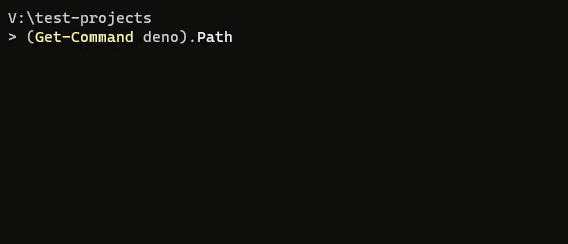

# bvm - Binary Version Manager

A version manager for all binaries.



NOTICE: This is a proof of concept. It is not recommended to use it yet as there will likely be many breaking changes.

## Goals

1. Seamless version selection based on current working directory.
2. Replace binary specific version manager tools.
3. No centralization—all urls and paths.
   - Allows for easily distributing approved binaries within an organization.
   - Easy for binary authors to distribute their applications.
4. Support completely different application binaries with the same command name.
5. Backwards compatibility loading project configuration files (once hitting 1.0)
6. **Works on Windows without needing WSL.**
7. Allows working with binaries already on the path (ex. `bvm use deno path`).

## Install

Install by running a script based on your environment:

- Shell (Mac, Linux, WSL): `curl -fsSL https://bvm.land/install.sh | sh`
- Windows
  - [Installer](https://github.com/dsherret/bvm/releases/latest/download/bvm-x86_64-pc-windows-msvc-installer.exe)
  - Or install via powershell: `iwr https://bvm.land/install.ps1 -useb | iex`

## Global Commands

### `bvm install <url>`

Installs a binary at the specified manifest file.

```
# Examples
bvm install https://bvm.land/deno/1.3.2.json
# optionally specify a checksum
bvm install https://bvm.land/deno/1.3.2.json@6444d03bbb4e8b0a7966f406ab0a6d190581c205291d0e082bc9a57dd8498e97
# if a previous installation is on the path, use this one instead
bvm install --use https://bvm.land/deno/1.3.1.json
```

- Provide the `--use` flag to force using this binary on the path (happens automatically if nothing is on the path).
- Provide the `--force` flag to force an install even if already installed.

### `bvm uninstall <name-selector> <version>`

Uninstalls the specified binary version.

```
# Examples
bvm uninstall deno 1.2.0
bvm uninstall denoland/deno 1.3.2
bvm uninstall name-stealer/deno 2.0.0
```

### `bvm list`

Displays the installed binaries.

Example output:

```
denoland/deno 1.2.0
denoland/deno 1.3.2
dprint/dprint 9.0.1
nodejs/node 14.9.0
```

### `bvm use <name-selector> <version-selector>`

Uses the specified binary name and version globally.

The binary and version must have been previously installed.

```
# Examples
bvm use deno 1.3.2
bvm use denoland/deno 1.3.2
bvm use name-stealer/deno 2.0.0
bvm use deno 1
bvm use deno 1.0
bvm use deno ^1.1
bvm use deno ~1.1
```

### `bvm use <name-selector> path`

Uses the version of the binary that's installed on the path if it exists.

```
# Example
bvm use deno path
```

### `bvm exec <name-selector> <version-selector> [command-name] [...args]`

Executes the version of the matching binary.

```
# Examples
bvm exec deno 1.3.1 -V
bvm exec deno path -v
bvm exec node ^12.1 -v
bvm exec node 14 npm -v
bvm exec nodejs/node ~8.2 -v
```

### `bvm resolve <command-name>`

Resolves the executable path of the specified command name based on the current working directory.

This command is used by the created shell/batch files (shims) to tell how to resolve the file.

```
# Example
bvm resolve deno
# on windows, outputs something like: C:\Users\YourUserName\AppData\Local\bvm\binaries\denoland\deno\1.3.1\deno.exe
```

### `bvm clear-url-cache`

Clears any cached urls.

## Registry commands

Adding a registry allows you to more easily install copies of a binary without dealing with urls.

### `bvm registry add <url>`

Adds or reassociates the registry at the specified url to the local CLI.

```
# Examples
bvm registry add https://bvm.land/deno/registry.json
bvm registry add https://bvm.land/node/registry.json
```

### `bvm registry remove <url>`

Removes the registry at the specified url from the local CLI.

```
# Example
bvm registry remove https://bvm.land/node/registry.json
```

### `bvm registry list`

Lists the registries saved in the CLI.

Example output:

```
denoland/deno - https://bvm.land/deno/registry.json
nodejs/node - https://bvm.land/node/registry.json
```

### `bvm install <name-selector>`

Installs the latest non-pre-release version of the specified binary based on the CLI's registries.

```
# Examples
bvm install deno
bvm install --use node
```

### `bvm install <name-selector> <version-selector>`

Installs the specified binary and version based on the first matching version in the CLI's registries.

```
# Examples
bvm install deno 1.3.3
bvm install deno 1
bvm install deno 1.3
bvm install deno ^1.3
bvm install --use node 14.9.0
```

## Projects

`bvm` allows for specifying versions of binaries to automatically use within a directory.

### Setup

1. Run `bvm init` in the project's root directory.
2. Open up the created _.bvmrc.json_ file and specify the paths to the binary manifest files.
   ```jsonc
   {
     // optional commands to run on pre and post install
     "onPreInstall": "",
     "onPostInstall": "",
     // list of binaries to use
     "binaries": [
       // Either specify:
       // 1. Urls
       "https://bvm.land/node/14.9.0.json",
       // 2. Urls with a checksum to ensure the remote file doesn't change
       "https://bvm.land/dprint/0.9.1.json@52b473cd29888badf1620ea501afbd210373e6dec66d249019d1a284cf43380b",
       // 3. Objects
       {
         "path": "https://bvm.land/deno/1.3.2.json",
         "checksum": "6444d03bbb4e8b0a7966f406ab0a6d190581c205291d0e082bc9a57dd8498e97", // optional for path above
         "version": "^1.3.0" // optional, won't install specified url if user has a version installed that matches
       }
     ]
   }
   ```
3. Run `bvm install`

### Commands

### `bvm init`

Creates an empty `.bvmrc.json` file in the current directory.

### `bvm install`

Downloads & installs the binaries in the current `.bvmrc.json` configuration file and associates them on the path with bvm if not previously done.

- Provide the `--use` flag to also use all the binaries in the configuration file on the path when outside this directory.
- Provide the `--force` flag to force an install of everything even if already installed or has a matching version.

### `bvm add [url]`

Adds the specified binary at the specified url to a project's `.bvmrc.json` file based on the current directory. Installs if necessary.

#### Example

```
bvm add https://bvm.land/deno/1.3.2.json
```

Configuration file would then contain:

```jsonc
{
  "binaries": [
    {
      "path": "https://bvm.land/deno/1.3.2.json",
      "checksum": "6444d03bbb4e8b0a7966f406ab0a6d190581c205291d0e082bc9a57dd8498e97",
      "version": "^1.3.2"
    }
  ]
}
```

### `bvm add [binary-name or owner-name/binary-name] [version-selector]`

Similar to above with a url, but adds the specified binary from an added registry.

The version is optional.

```
# Examples
bvm add deno 1.3.1
bvm add deno ~1.3.1
bvm add node
```

### `bvm use`

Uses all the binaries in the current configuration files globally on the path.

Generally it's not necessary to ever use this command as this happens automatically being in the current directory.

## Redirect Service

The website https://bvm.land is a redirect service. If you publish a _bvm.json_ file as a GitHub release asset (not recommended yet, due to this being a proof of concept) then you can use `https://bvm.land` to redirect to your release:

1. `https://bvm.land/<owner>/<name>/<release-tag>.json` -> `https://github.com/<owner>/<name>/releases/download/<release-tag>/bvm.json`
2. `https://bvm.land/<name>/<release-tag>.json` -> `https://github.com/<name>/<name>/releases/download/<release-tag>/bvm.json`

Example: `https://bvm.land/dprint/0.9.1.json`

## Binary manifest file

At the moment, it looks like this:

```jsonc
{
  "schemaVersion": 1,
  "name": "deno",
  "owner": "denoland",
  "version": "1.3.1",
  "description": "A secure JavaScript and TypeScript runtime.",
  "windows-x86_64": {
    "path": "https://github.com/denoland/deno/releases/download/v1.3.1/deno-x86_64-pc-windows-msvc.zip",
    "type": "zip",
    "checksum": "6ba068e517a55dd33abd60e74c38aa61ef8f45a0774578761be0107fafc3758b",
    "commands": [{
      "name": "deno",
      "path": "deno.exe"
    }],
    "onPreInstall": "# run any command pre installation (ex. kill process)",
    "onPostInstall": "# this is where you can run some commands if necessary to cause additional setup",
    "onUse": "# command to execute when using this",
    "onStopUse": "# command to execute when stopping use of this"
  },
  "linux-x86_64": {
    "path": "https://github.com/denoland/deno/releases/download/v1.3.1/deno-x86_64-unknown-linux-gnu.zip",
    "type": "zip",
    "checksum": "ef3a8740bdceab105808c91cfb918c883a23defb6719b9c511e2be30d5bfdc01",
    "commands": [{
      "name": "deno",
      "path": "deno"
    }]
  },
  "darwin-x86_64": {
    "path": "https://github.com/denoland/deno/releases/download/v1.3.1/deno-x86_64-apple-darwin.zip",
    "type": "zip",
    "checksum": "b1bc5de79b71c3f33d0151486249d088f5f5604126812dc55b1dd21b28704d8a",
    "commands": [{
      "name": "deno",
      "path": "deno"
    }]
  }
}
```

Supported types: `zip`, `exe`, `tar.gz` (will add more later)

Other examples:

- Multiple commands: [https://bvm.land/node/14.9.0.json](https://bvm.land/node/14.9.0.json)
